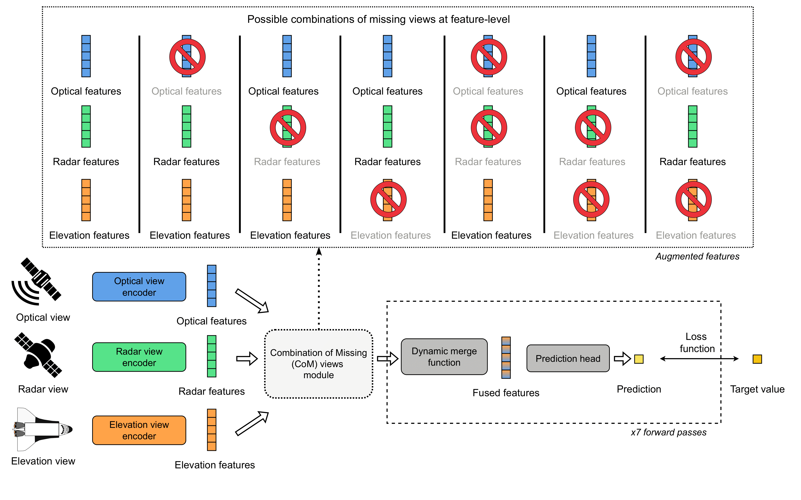
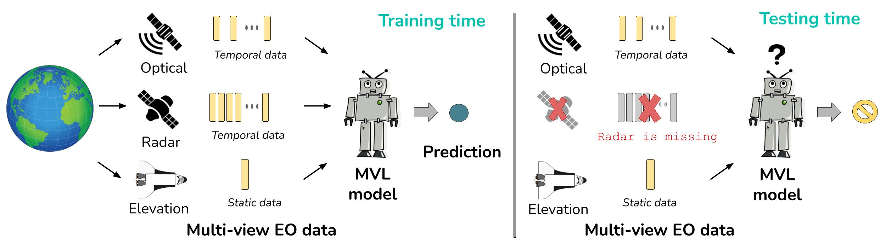

# CoM: all Combinations of Missing views in the Earth observation domain
[](https://www.arxiv.org/abs/2501.01132) 
[](https://doi.org/10.1016/j.neucom.2025.130175)

> Public repository of our work [*Missing Data as Augmentation in the Earth Observation Domain: A Multi-View Learning Approach*](https://doi.org/10.1016/j.neucom.2025.130175)
---



The previous image illustrates our **FCoM** approach in a Multi-view learning model implementing Feature-level fusion. We focus on multi-view Earth observation applications, including classification and regression tasks.

## Training
We provide config file examples on how to train our model with different dynamic merge functions. The examples are on the CropHarvest data.

* To train the feature-level CoM with **average fusion**:  
```
python train.py -s config/com_average.yaml
```

* To train the feature-level CoM with **gated fusion**:  
```
python train.py -s config/com_gated.yaml
```

* To train the feature-level CoM with **cross-attention fusion**:  
```
python train.py -s config/com_cross.yaml
```

* To train the feature-level CoM with **memory-based fusion**:  
```
python train.py -s config/com_memory.yaml
```

> [!NOTE]  
> Read about the used data in [data folder](./data)

## Evaluation

* To evaluate the predictive performance:
```
python evaluate_predictions.py -s config/evaluation.yaml
```

* To evaluate the performance robustness:
```
python evaluate_rob_pred.py -s config/evaluation.yaml
```

---

### Baselines
* To train ensemble based aggregation with sensor invariant ([Reference](https://arxiv.org/abs/2407.15512))
```
python train_ensemble_baseline.py -s config/baseline_ensemble.yaml
```

* To train input fusion with temporal dropout ([Reference](https://doi.org/10.1016/j.isprsjprs.2022.03.012))
```
python train_input_baseline.py -s config/baseline_inputTempD.yaml
```

* To train input fusion with sensor dropout ([Reference](https://arxiv.org/abs/2407.15512))
```
python train_input_baseline.py -s config/baseline_inputSensD.yaml
```

* To train feature fusion with sensor dropout ([Reference](https://doi.org/10.1109/TGRS.2024.3387837))
```
python train.py -s config/baseline_featureSensD.yaml
```

* To train feature-level concatenation fusion with CoM ([Reference](http://doi.org/10.1186/s13634-023-01008-z))
```
python train.py -s config/baseline_featureCoM.yaml
```

---


# 🖊️ Citation

Mena, Francisco, et al. "*Missing Data as Augmentation in the Earth Observation Domain: A Multi-View Learning Approach*." Neurocomputing, 2025.
```bibtex
@article{mena2025missing,
  title = {Missing data as augmentation in the Earth Observation domain: A multi-view learning approach},
  author = {Mena, Francisco and Arenas, Diego and Dengel, Andreas},
  journal = {Neurocomputing},
  volume = {638},
  year = {2025},
  issn = {0925-2312},
  doi = {10.1016/j.neucom.2025.130175},
  publisher={Elsevier},
}
```
